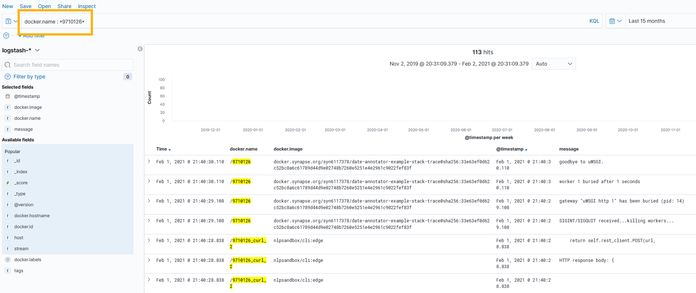

## Sage Data Hosting Site

The SOP below describes how to access the logs of a submission on the Sage Data
Hosting Site given an submission ID.

- Login to Sage VPN
- Go to [NLP Kibana](http://10.23.60.253) (credentials in Sage favorite password
  manager under NLP-ELK stack)
- Click to on the app menu, under `Kibana`, click `Discover`

    

- Click `Open`, then search and click `nlp-submissions`

    

- Update the time frame if needed

    

- If you want to look for a particular submission, you can query the logstash
  by using Keyword Query Language (KQL). It is important to add the backslash
  at the beginning.  (e.g, looking for submission `9710071`)

    
